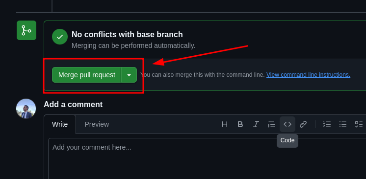

# 1TDSR

## Recomendações de atualizações:

### No terminal

1. Fazer o clone na sua máquina

```bash
git clone git@github.com:Japitu/1TDSR.git
```

2. Entrar na pasta 1TDSR

```bash
cd 1TDSR
``` 

3. Caso já tenha a pasta na sua maquina, antes de começar a trabalhar, faça um Pull:

```bash
git pull
```

Assim irá atualizar o seu repositório local com o repositótio no GitHub

4. Criar uma branch para trabalhar na atualização. O nome da branch tem a ver com a tarefa que será feita

``` bash
git checkout -b <nome-da-sua-brach>
```

5. Faça as alterações necessárias. Após terminar, faça o commit 

```bash
git add .
git commit -m 'Nome da mensagem'
```

6. Fazer o push para o repositório, porém pela branch que foi criada. Não voltar para main/master

```bash
git push origin <nome-da-sua-brach>
```


### No GitHub

1. Acesse o repositório no GitHub. Após fazer o push verá a tela abaixo. Clique em **Compare & pull request**.


2. Prencha o título e adicione uma descrição se achar necessário

3. Solicite a revisão de um dos responsáveis


4. Só clicar em **Create pull request**.

5. Após a aprovação do PR (Pull Request) clique em **Squash and merge** para fazer o Merge.



